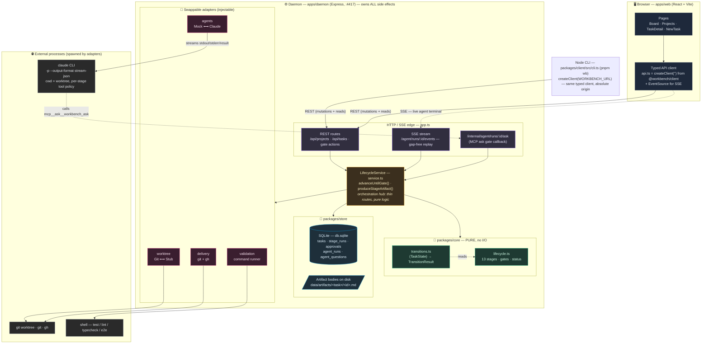
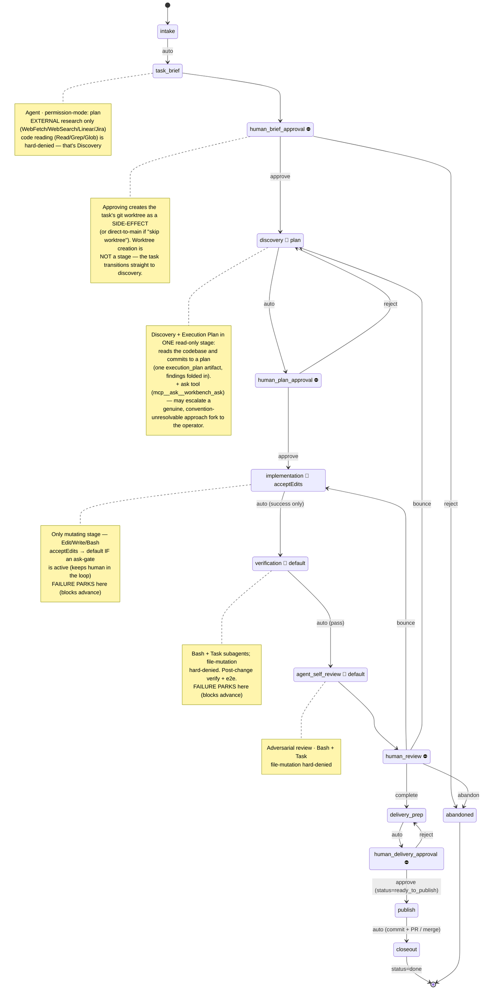

# Agent Workbench — Architecture

Two diagrams:

1. **Layered architecture** — the browser/daemon boundary and how the daemon
   composes the pure core, the store, and the swappable adapters.
2. **Task lifecycle** — the 13 ordered stages, human gates, and the per-stage
   Claude permission mode each agent stage runs under.

A third section, [Where this fits in the agent-harness design
space](#3-where-this-fits-in-the-agent-harness-design-space), classifies the
system against the empirical taxonomy from Hu Wei, *Architectural Design
Decisions in AI Agent Harnesses* (arXiv:2604.18071).

---

## 1. Layered architecture

### Reading it

- **The browser never touches git, the filesystem, or a shell.** It only speaks
  REST + SSE to the daemon. Every side effect lives behind the daemon edge.
- **One typed client, two consumers.** `@workbench/client`'s `createClient(baseUrl)`
  is the single typed wrapper over the daemon API. The browser binds it to `''`
  (same-origin, relative paths); a Node process — the `wb` CLI — binds it to the
  daemon's absolute origin (`WORKBENCH_URL`, default `:4417`). `fetch` is global
  in both, so the headless path adds no HTTP dependency and the daemon stays the
  single owner of side effects.
- **`LifecycleService` is the hub.** HTTP/SSE routes stay thin; the service
  composes the pure `core` rules with `store` persistence and the four adapters.
- **`core` is pure** — lifecycle definition and transition functions with no I/O,
  so the entire state machine is unit-testable in isolation.
- **Adapters are swappable.** `mock` vs `claude` agents, real git vs stub
  worktree — this is what lets the whole pipeline run end-to-end in tests without
  invoking a real LLM or mutating a real repo.
- **The MCP ask gate is a loop:** the spawned `claude` CLI can call
  `mcp__ask__workbench_ask`, which calls back into the daemon's `/internal` route
  and long-polls until a human answers in the UI.

---

## 2. Task lifecycle (13 stages + permission modes)

### Permission-mode summary

| Stage | Mode | Allowed | Hard-denied |
|-------|------|---------|-------------|
| `task_brief` | `plan` | WebFetch, WebSearch, Linear/Jira MCP | **Read, Grep, Glob**, Bash, Edit, Write, NotebookEdit |
| `discovery` (Discovery + Execution Plan) | `plan` | Read, Grep, Glob, **ask tool** | Bash, Edit, Write, NotebookEdit |
| `implementation` | **`acceptEdits`** | Read, Edit, Write, Bash | *(none)* |
| `verification` | `default` | Read, Grep, Glob, Bash, Task | Edit, Write, NotebookEdit |
| `agent_self_review` | `default` | Read, Grep, Glob, Bash, Task | Edit, Write, NotebookEdit |
| *(fallback)* | `plan` | Read, Grep, Glob | Bash, Edit, Write, NotebookEdit |

**Key safety properties**

- **Read-only stages** (discovery+plan, task_brief) get their guarantee from two
  things together: `--permission-mode plan` **and** hard-denying the mutation
  tools — not just the allowlist.
- **`task_brief` does EXTERNAL research only.** It may load the originating
  ticket (web/Linear/Jira) but code reading (Read/Grep/Glob) is hard-denied —
  exploring source is Discovery's job, kept as a capability boundary.
- **`implementation` is the only stage that can change files**, running
  `acceptEdits` so the unattended auto-advance driver can apply the plan.
- **Mid-run downgrade:** if an ask-gate is active, `acceptEdits` falls back to
  `default` so edits aren't silently auto-approved with a human watching
  (`packages/agents/src/claude.ts:256-258`).
- **Two stages park on failure** — `implementation` and `verification` block
  the pipeline. Verification gates on NEW failures only: it lazily captures a
  pre-change baseline (when a check fails) and advances if that check was
  already failing before the task, so pre-existing red doesn't block delivery.

### Source of truth

- Stage order & gates: `packages/core/src/lifecycle.ts`
- Transition rules: `packages/core/src/transitions.ts`
- Per-stage policy table: `packages/agents/src/index.ts` (`STAGE_TOOL_POLICY`)
- CLI invocation + ask-gate downgrade: `packages/agents/src/claude.ts`
- Orchestration: `apps/daemon/src/service.ts` (`advanceUntilGate`, `produceStageArtifact`)
- Typed daemon client (browser + `wb` CLI): `packages/client/src/{client,cli}.ts`
- Self-targeting guard (a project on the daemon's own checkout is forced into an
  isolated worktree — never direct/skip-worktree, so an agent can't edit the code
  or SQLite DB driving its own run): `apps/daemon/src/paths.ts` (`REPO_ROOT`) +
  `service.ts` (`isSelfTargeting`)
- Worktree location invariant: a task worktree is ALWAYS a worktree branched off
  its project's repo, and lives ADJACENT to that repo at
  `<dirname(repoPath)>/.workbench-worktrees/<repo-basename>/<task-id>-<slug>` —
  never nested inside the workbench's own working tree. Derived by
  `worktreePathFor(project.repoPath, …)`: `packages/worktree/src/naming.ts`

---

## 3. Where this fits in the agent-harness design space

Hu Wei's *Architectural Design Decisions in AI Agent Harnesses*
(arXiv:2604.18071) is an empirical study of 70 agent-system projects. It does
not prescribe one architecture; it codes each project against **five recurring
design dimensions** and clusters them into **five recurring patterns**. Mapping
agent-workbench onto that frame:

### Classified architecture: **Pattern 2 — "Balanced CLI Framework"** (with a Pattern-3 safety posture)

The paper's bundle for Pattern 2 — *"basic or tool-based delegation subagent
architecture; file-based context persistence (jsonl, markdown); MCP-first or
decorator-based tool registration; process-level sandboxing with command
filtering; declarative configuration for tools,"* positioned as
*"developer-facing command-line assistants, coding tools, and extensible
productivity frameworks"* — is a near-exact description of this system.

| Dimension (paper's coded options) | Agent Workbench | Evidence |
|---|---|---|
| **Subagent architecture** | **tool-based delegation** | One Claude CLI per stage; `verification` / `agent_self_review` fan out via the `Task` tool to subagents — delegation, not a recursive orchestrator-worker tree |
| **Context management** | **file-persistent + hybrid** | Artifact bodies as `.md` on disk + SQLite metadata; agents receive per-stage packets, not full history |
| **Tool systems** | **MCP-first + registry** | `STAGE_TOOL_POLICY` is a per-stage allow/deny registry; the question gate is an MCP tool (`mcp__ask__workbench_ask`) |
| **Safety — approval** | **policy-structured** *(Pattern 3+ level)* | Four human gates + per-stage `plan`/`acceptEdits`/`default` modes form a control stack, not mere confirmation prompts |
| **Safety — isolation** | **process separation** | Per-task git worktree; `claude` spawned with `cwd = worktree`, no `--add-dir` |
| **Safety — audit** | **structured audit** | Every stage entry recorded as a `StageRun`; approvals, agent runs, and events persisted |
| **Orchestration — workflow** | **imperative** | `advanceUntilGate()` driver loop |
| **Orchestration — planning** | **plan-and-execute** | Explicit `discovery` (read + plan) → `human_plan_approval` → `implementation` → `verification` |

### The notable deviation from a plain Pattern 2

The paper observes that across the corpus *"intermediate isolation is common but
high-assurance audit is rare,"* and that weaker projects *"add only confirmation
prompts, whereas others align approval, isolation, and audit into a coherent
control stack."*

Agent Workbench sits in that rarer second camp. Its **policy-structured approval**
(four human gates + the `plan` → `acceptEdits` → `default` permission ladder,
including the mid-run `acceptEdits → default` downgrade when an ask-gate is
active) combined with **worktree isolation** and a **StageRun audit trail** is
the "coherent control stack" the paper associates with Pattern 4
(enterprise/full-featured). In short: a **Balanced CLI Framework body with an
enterprise-grade safety/governance spine** — heavier on approval+audit than a
typical Pattern 2 project, lighter on multi-agent coordination than Pattern 3.

### What it deliberately is *not*

- **Not Pattern 3 (multi-agent orchestrator):** no orchestrator-worker or
  recursive subagent nesting, no event-driven coordination — the lifecycle is a
  single imperative stage machine.
- **Not Pattern 4 (enterprise):** no container/wasm sandboxing, no vector-DB
  memory, no plugin versioning/dependency management. Isolation stops at the git
  worktree (process separation).

### Source

Hu Wei. *Architectural Design Decisions in AI Agent Harnesses.* arXiv:2604.18071
(cs.AI, 2026). Five dimensions: subagent architecture, context management, tool
systems, safety mechanisms, orchestration. Five patterns: (1) Lightweight Tool,
(2) Balanced CLI Framework, (3) Multi-Agent Orchestrator, (4) Enterprise
Full-Featured, (5) Scenario-Verticalized.
